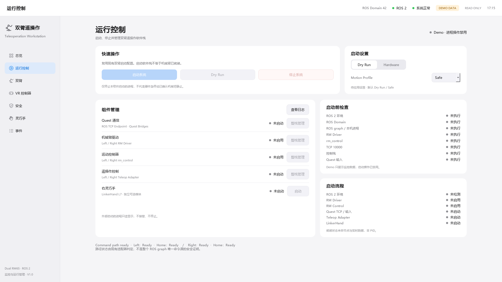
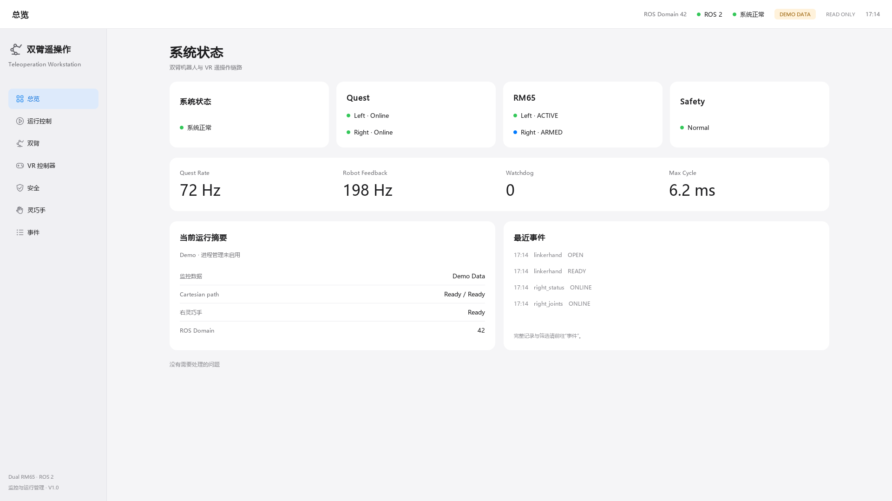

# Dashboard V3 — 监控与运行管理

## 基线与范围

- 分支：`feat/teleop-dashboard`，V2 基线 `92329dc39e61622ca668dea953bd11c7dcba9685`。
- PR #10 持续更新，不合并；本次没有启动真实 RM Driver、rm_control、Quest 硬件、SDK 或机械臂。
- 窗口名称：双臂机器人遥操作监控与运行管理系统 V1.0。
- 完整阅读 dual/right/left launch、hardware.yaml、STATUS、INTERFACE 与双臂现场记录后实施。
- 系统沿用 Sidebar / Toolbar / QStackedWidget，新增运行控制页。总览删除大机器人图，
  改为状态、四项指标、当前摘要和最近事件。全部界面为 Qt/QPainter/QSS，没有装饰位图。

## 架构与边界

```text
Qt thread (10 Hz)
  ├─ unchanged SystemSnapshot / ROS EventLogger
  │    └─ unchanged RosMonitorRuntime + executor thread (13 subscriptions)
  └─ RuntimeSnapshot / immutable copies + lock
       └─ RuntimeService worker (2 Hz, intent queue, priority Stop)
            ├─ read-only graph evidence + local process/port checks
            ├─ ProcessManager: dual launch group
            └─ ProcessManager: optional independent hand group
```

`models.py`、`ros_monitor.py`、`demo_data.py` 与基线字节等价（归一化行尾）；
既有 JSON parsing、13 topics、线程模型、SnapshotStore 和 ROS EventLogger 不变。
所有新增模块均没有 ROS command publisher、service client、action client。
Process Manager 只启动既有程序，不发送机器人运动请求，也不实现第二套机器人安全状态机。

进程 RUNNING 仅表示 Popen 存活。组件 READY 需要唯一预期节点及实时数据：

| 组件 | 身份及就绪证据 | 依赖 |
|---|---|---|
| Quest | /UnityEndpoint、两侧 quest_*_target_bridge；10000 listener；两侧原始 pose+inputs fresh | ROS 环境 |
| Driver | /left/rm_driver、/right/rm_driver；TCP pose 与 joint feedback fresh | ROS 环境、Hardware |
| Control | /left/rm_control、/right/rm_control；两侧 adapter 的 Home path ready | Driver、Hardware |
| Adapter | /left_rm65_teleop_adapter、/rm65_teleop_adapter；status fresh/解析有效 | Quest；Hardware 还需 Driver/Control |
| Hand | /right_linkerhand；有效状态、模式、通信/故障/输入条件 | 独立可选 |

这些是 UI 就绪证据，不是物理安全认证。组件启动顺序仍由原 dual launch 负责，
UI 以整栈管理四个核心组件，不提供会绕开依赖的独立 driver/control/adapter 按钮。
手的 CONNECT_ONLY 与 READY/DRY_RUN 使用真实节点各自的条件；故障或未知模式不能显示 READY。

## 实际命令

默认 Dry Run（以下仅展示命令）：

```bash
ros2 launch rm65_teleop_adapter dual_quest_teleop.launch.py \
  mode:=dry_run motion_profile:=safe \
  start_drivers:=false start_controls:=false \
  start_tcp:=true start_bridges:=true start_status:=true \
  start_linkerhand:=false linkerhand_connect_only:=false \
  use_right_rviz:=false use_left_rviz:=false
```

Hardware 使用同一个命令，只把 mode 改为 hardware，start_drivers/start_controls 改为 true。
Profile 仅允许 safe / normal，来自 dual launch validation；没有 fast 选项。
每个参数名称都有针对当前 launch 的 AST 契约测试，不修改原 bringup。

独立右手：

```bash
ros2 run rm65_teleop_adapter right_linkerhand_node --ros-args \
  -r __node:=right_linkerhand -p dry_run:=true \
  -p hardware_write_enabled:=false -p connect_only:=false
```

硬件手显式启动改为 dry_run=false / hardware_write_enabled=true，其他参数不变。
它不跟随“启动系统”。该入口会连接现有 SDK，现有共存风险并未修复；
必须额外勾选第二 API 连接风险确认，且已安装节点声明的 SDK 适配文件必须可读。
Dashboard 从已安装节点源码读取默认 SDK 路径，不复制现场绝对路径，也不导入 SDK 作检查。

## Preflight 与启动

- 确认环境/包可用、ROS_DOMAIN_ID 是 0–232、graph 和本机进程可检查。
- 检查重复 driver/control/adapter、端口 10000、已运行控制栈；拒绝重复整栈启动。
- 端口观察仅读取 `/proc/net/tcp{,6}`，不周期性 bind/connect。读取失败保守阻塞；
  TIME_WAIT 也视为占用，因此有连接的现场停止后可能需稍等再启动。
  尚未 listen 的绑定可能不在该表中；端口无记录不保证 bind 成功，原 dual launch
  的启动前端口检查仍负责最终判断，READY 仍必须有实际 TCP listener。
- Hardware 还检查已安装 driver/control dual launch、无已有手连接。
- Quest 输入未到达为 warning：TCP 通常尚未启动；启动后必须收到原始输入才就绪。
  bridge 一直发布 target，因此 target 存在或 50 Hz 不能替代 Quest freshness。
- Hardware 三个人工项：工作空间无人、硬件急停可触及、操作者准备好 Quest 响应。
  软件不会自动推断它们；不勾选不能启动，manager 层再次检查。
- 手的独立 Hardware 确认还包含未关闭的共存风险，默认不启动。
- 每次启动在 worker 获取新的检查结果；UI 上旧的通过状态不能绕过重检。

环境先使用当前环境/安装前缀，可传 `--workspace-setup` 或
`TELEOP_WORKSPACE_SETUP`。桌面进程通过安全引用的 bash source Humble 与当前
workspace setup，再用 /usr/bin/python3 重新进入 GUI；不依赖 Conda。
已安装包按 AMENT_PREFIX_PATH 的第一个 marker 解析，不能用 underlay 掩盖坏的 overlay。

## 所有权与停止

- 每次 Popen 使用 start_new_session=True，保存自建 session/PID。
- 不接管外部 PID；External 仅展示，不能停止。
- Stop 有独立优先通道，不会因启动队列已满而丢失，并取消未执行的启动请求。
- Stop 不依赖 graph 读取成功。仅自建 session 的进程组收到 SIGINT；
  5 秒后仍存活则 SIGTERM，再 5 秒后 SIGKILL。
- launch leader 意外退出也会清理该 session 的后代；不自动重启。
- 应用退出停止两个自有启动组，ROS 线程/node/context 在 finally 清理。
- 全组退出不证明机器人静止，更不等于控制柜硬件急停。
- stdout/stderr 每组最多 1000 段、每段最多 4096 字符，在独立只读日志窗口查看。
  事件页合并生命周期事件和原有 ROS 状态变化，最多 500 条，不逐行复制 stdout。

## 测试与视觉审查

TDD 顺序：launch command RED/GREEN → preflight RED/GREEN → fake lifecycle RED/GREEN →
环境/graph RED/GREEN → worker/UI integration → review regression cases。
包括 start/failure/unexpected exit、重复/外部进程、manual gate、SIGINT/TERM/KILL、
关闭清理、graph 故障下 Stop、队列满时 Stop、hand dry-run/hardware 条件与安全静态检查。

Windows 的 ROS 和 POSIX 测试有明确平台 skip；Ubuntu CI 使用系统 Python 3.10/PyQt5。
CI 运行五包 build/test、13 路真实 ROS 订阅 probe、POSIX sleeping fixtures、真实 dual
Dry Run 生命周期和未 source 桌面入口。CI 只安装 RealMan 消息，不安装真实 driver/SDK。
现场未版本化 RS485 SDK 对应的旧 transport CTest 组继续按原 CI 边界排除。

最终软件验证（2026-10-04，代码提交 `f96b2f3201a493a914f2fbabfde0bbd30b89d70d`）：

| 验证 | 结果 |
|---|---|
| Windows Dashboard | 113 passed，4 个预期 ROS/POSIX 平台 skip，4 subtests passed |
| Ubuntu 22.04 / Humble Dashboard | 117 passed |
| 五包 colcon build 与 Dashboard 单包 build | 全部成功 |
| 五包 colcon test-result | 385 tests，0 errors，0 failures，0 skipped（上述 SDK CTest 组未纳入） |
| 真实 ROS 接收 probe | 13 subscriptions；0 publishers、services、clients；线程正常退出 |
| Linux process lifecycle | SIGINT 正常退出、超时 TERM/KILL、leader 退出后的后代清理；外部进程保留 |
| 实际 dual launch Dry Run | 两侧 dry_run 状态有效；无 driver/control/hand 节点及机器人命令 topic |
| Dry Run Stop | 自有启动组退出，TCP 10000 释放 |
| 无 source 桌面入口 / 离线 ROS 入口 | 渲染并干净退出 |

Ubuntu PR 验证：[run 37173055149](https://github.com/Kiklyyy/quest-rm65-teleop/actions/runs/37173055149)，
全部步骤成功；对应 push 验证也成功。CI artifact `teleop-dashboard-validation`
包含 JUnit、colcon 输出和 Ubuntu 截图。首次 Ubuntu 字体检查暴露的 1280×720 总览高度问题
已通过缩小内部留白修复，未放宽布局断言；同一异常重复产生事件的问题也已补测试修复。

静态审计确认 ROS 层仍只有 13 路订阅，新增 process 层没有机器人 ROS 输出端点。
整个开发与验证过程没有启动真实硬件。硬件模式的命令与确认门禁已测试，现场硬件运行未验证。

2026-10-04 复验补充：文档提交 `d6b03b3` 的两次 CI 暴露 smoke 检查顺序问题：
两个 Adapter status 先到时，TCP Endpoint 还未监听，脚本过早断言失败。
生产 READY 原本已有 listener 条件；现将 smoke 同时等待全部软件节点、有效 dry_run
状态与 TCP 监听（不要求真实 Quest 输入），超时附 graph 和进程日志。
新增时序回归覆盖 Adapter → nodes → TCP 的到达顺序；另外移除 observer 周期性试绑定，
新增 IPv4/IPv6、本地/远端端口、TIME_WAIT、读取失败与无 socket 调用的回归检查。
本次 CI 失败没有证据可归因于试绑定；后者是只读观察边界的独立修正。
修复后的 PR 与 push CI 均通过完整验证。Probe 的清理另采用嵌套 finally，
确保进程组清理报错时仍执行 ROS monitor 停止；生产 app 已有相同保障。

七页 1920×1080，以及总览/运行控制 1366×768 已生成并逐张检查。
1920 运行页全部内容可见；1366 运行页使用明确的纵向滚动，未出现水平溢出或重叠。
中文完整，六关节/七手通道分开。Demo 显示 DEMO DATA、进程操作禁用；
不会伪造 PID 或实际 launch 成功。

截图目录：`docs/screenshots/runtime-management/`



