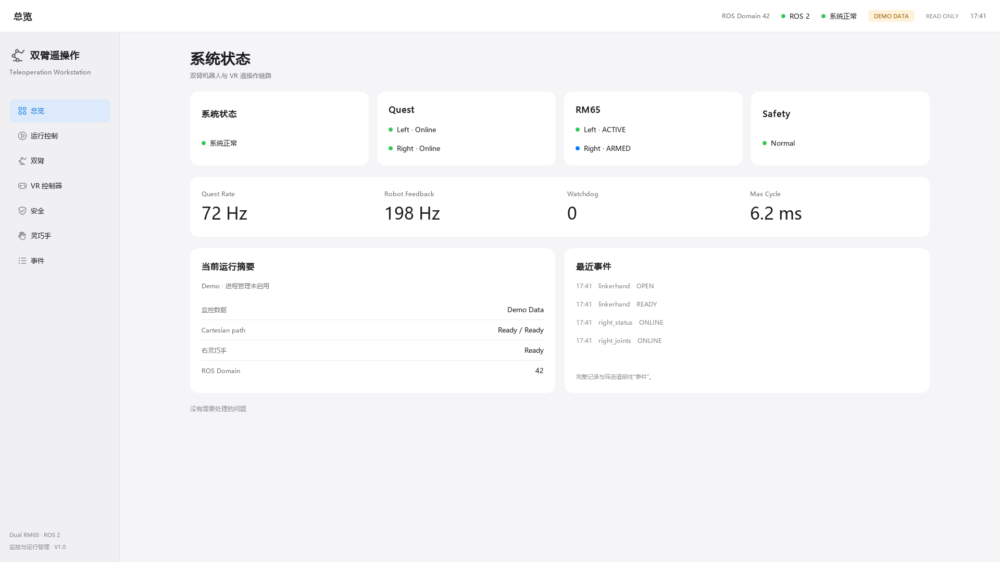
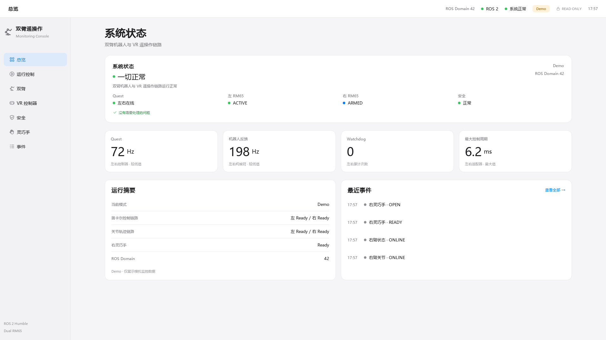
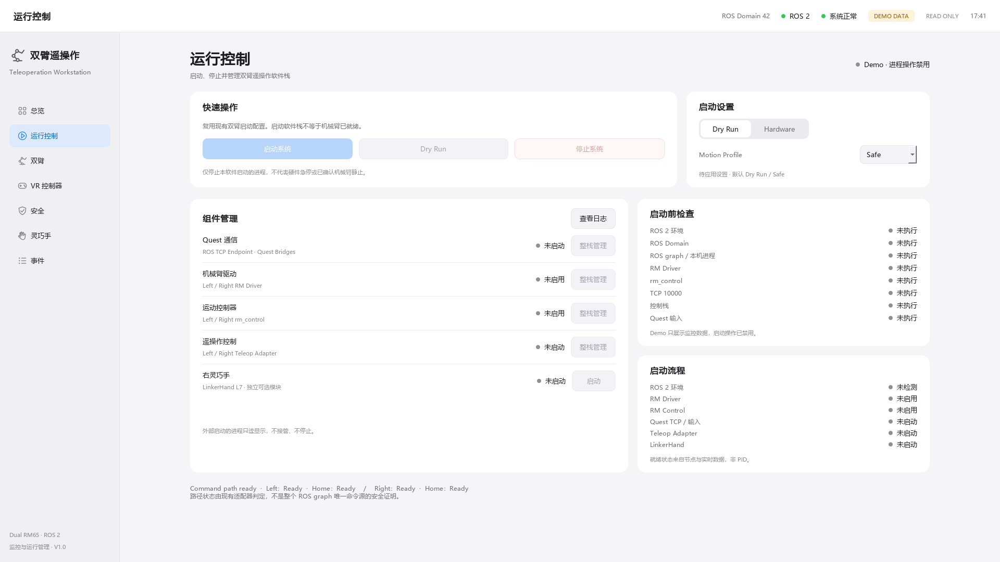
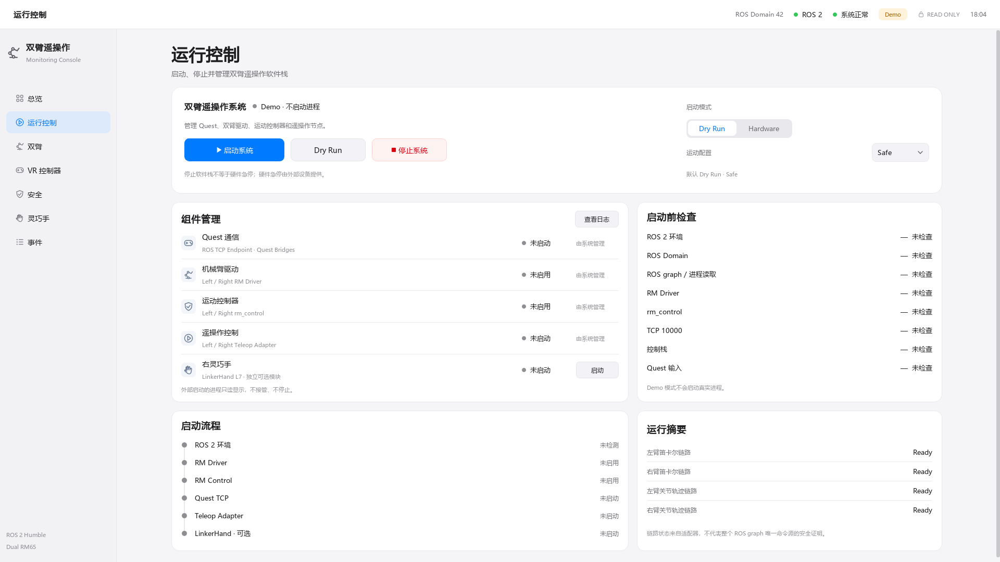

# Dashboard V4 — Presentation only

基线：`99c16e286b39ddd883123bdceb7612826041cc64`，分支 `feat/teleop-dashboard`，PR #10 保持 OPEN、不合并。
本轮只精修展示，不增加机器人、ROS、进程或安全功能；没有启动真实硬件。

## 视觉变化

- 56 px Toolbar、224 / 196 px Sidebar，主内容最大宽度 1480 px；大屏与 compact 两档。
- 标题 32 / 28 px、指标 38 / 32 px，正文仍为 13 px，不靠缩小正文适配小屏。
- PrimaryPanel、MetricTile、SettingsGroup 与普通 Card 分层；统一浅边界、圆角和局部状态点。
- 总览：一张主摘要、四张指标卡、运行摘要和四条最近事件。原来的 min/total/max 指标计算不变，
  标注左右较低值，避免将其误称为平均值；完整原始事件仍在事件页和 tooltip 中。
- 运行控制：操作与启动设置合并，启动按钮 192×44，次要操作 144×44；组件改为 Settings 行，
  四个整栈组件显示“由系统管理”，右手保留原有操作；六步连线时间线与链路摘要置于下方。
- 按钮图形、勾号、锁和下拉箭头为本地 QPainter 矢量；没有图片背景、3D、网络图标或新主题。
- 1366 的运行页保留纵向滚动，首屏完整显示主要操作、组件与预检。总览 1280×720 保持无滚动。
- 其余五页仅调整共享排版与尺寸：六关节、七手通道、控制映射、折叠详情和原有日志筛选全部保留。

## 不变的行为边界

以下文件相对 V3 没有修改：`models.py`、`ros_monitor.py`、`demo_data.py`、`app.py`、
`process_manager.py`、`preflight.py`、`runtime_service.py`、`runtime_observer.py`、
`process_environment.py`、`runtime_dialogs.py`。测试对十个文件做 SHA-256 内容校验，
仅归一化跨平台 checkout 行尾；Git diff 再检查完整文件内容不变。

启动命令、模式键、Safe/Normal 真实配置值、预检、人工确认、外部进程保护、右手默认关闭、
SIGINT→SIGTERM→SIGKILL 生命周期，以及原 ROS 层 13 subscriptions / 0 outputs 均保持 V3。
机器人包、launch 和配置文件未修改。CI 仅更新截图路径并补 runtime 1366 图，回归检查未删减。

Demo 使用 `demoPreview` QSS 属性还原按钮颜色，按钮仍 disabled，原槽函数与 service guard 不变。
首屏明确写“Demo · 不启动进程”，tooltip 重复说明；没有新增弹窗或进程路径。
真实鼠标测试连接 `RuntimeService.demo()`，分别切换 Dry Run / Hardware，点击启动、Dry Run、
停止、右手启动：0 启动/停止信号、0 排队请求、0 ProcessManager.start 调用、0 PID。
退出 Demo 会清除 preview 属性，已有正常 Dry Run 点击测试继续验证唯一启动请求。

## 两轮视觉 QA

Round 1（总览/运行控制，1920 与 1366）：

- 主摘要项和最近事件行横向漂浮：改为明确的左对齐容器与尾部 stretch。
- 当前字体缺少播放/勾号，Combo 箭头呈方块：统一改为 QPainter 图形。
- 1920 时间线末项进入滚动区：重排卡片内部间距，使六个步骤完整可见。
- 1280 总览超出无滚动测试 19 px：减 compact 内边距与行间距，正文不缩小，原断言未放宽。

Round 2（七页 1920 + 总览/运行控制 1366，逐张复核）：

- 待启动模式容易误解为实际运行模式：改标签为“启动模式”。
- 首屏 Demo 状态明确为“不启动进程”。
- 双臂链路 Ready 文案标注左/右，消除顺序歧义。
- 独立审查将预检标题收窄为“ROS graph / 进程读取”，避免暗示它能证明没有重复节点。
- Ubuntu 首轮 CI 暴露 Noto CJK 行高使 1280 总览溢出 18 px：小屏四项摘要改为
  “名称＋状态”同行，保留字号与内边距；大屏布局不变，继续用原无滚动断言验证。
- CTA 主次、timeline 连线、组件/预检对齐、中文、指标字号和各页样式检查通过；
  未发现重叠、横向裁切或缺字。1366 运行页使用清晰可见的纵向滚动。

## 验证

Windows 本地完整 Dashboard：**137 passed、4 个预期 ROS/POSIX skip、4 subtests passed**。
原 117 项 Ubuntu 测试对应的用例全部保留，新增 Demo no-op、组件构造、十四个双分辨率截图/
surface 不重叠检查，以及七个新增行为文件冻结检查。原 1280×720 导航与无滚动测试通过。
Ubuntu 五包构建、回归、ROS 接收与生命周期验证由 PR CI 继续执行，实际结果以 CI 链接为准。
既有现场未版本化 LinkerHand SDK transport 测试组仍按 V3 CI 边界排除，不连接 SDK。

## V3 → V4 对比

Before 在任何代码修改前由 V3 入口重新生成，保存在 `docs/screenshots/v4-before/`；原 V3 截图未覆盖。

| 页面 | V3 Before | V4 |
|---|---|---|
| 总览 |  |  |
| 运行控制 |  |  |

全部九张 V4 截图：`docs/screenshots/v4/`，包括双臂、控制器、安全、灵巧手、事件和两张 1366 图。
