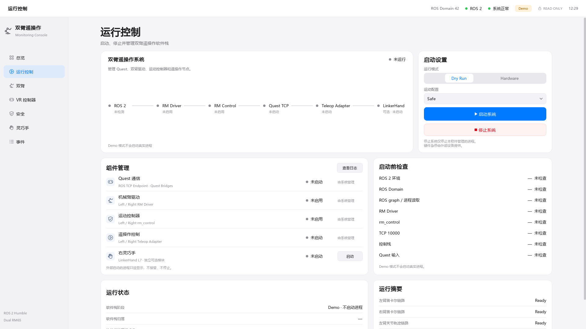
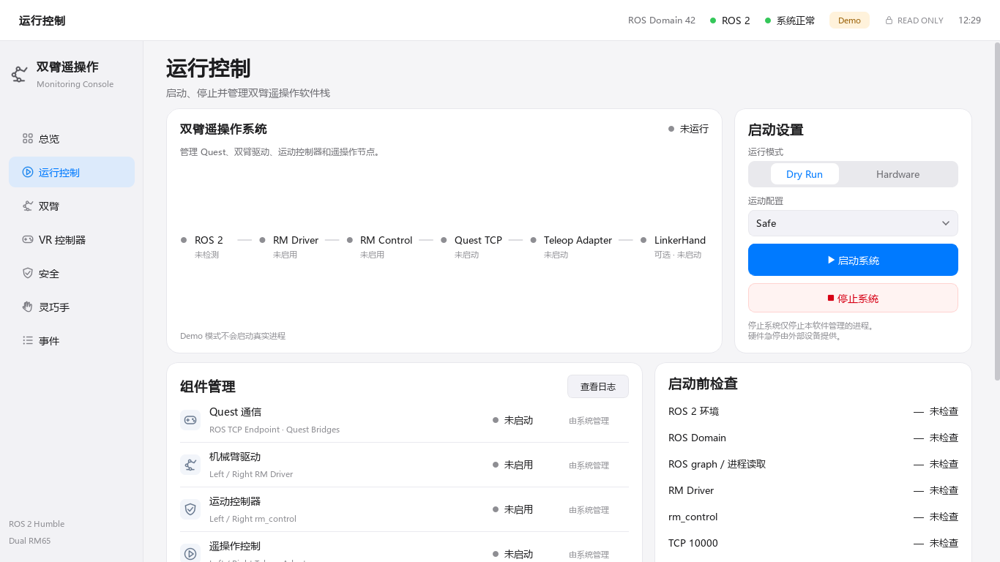

# Dashboard V5.1 — Separate runtime state and startup settings

基线 `0a23799d46c716f86c9e823a32ccbd54ea98d8e1`，分支 `feat/teleop-dashboard`。
PR #10 保持 OPEN，不合并。本轮没有启动真实硬件。

## 有界 UI 修订

- 只拆分运行页顶部：左侧 70% 状态 / Flow，右侧 30% 纵向启动设置，间距 16 px、两侧等高。
- 删除独立 Dry Run 快捷按钮。统一选择 Dry Run / Hardware、Safe / Normal 后点击“启动系统”。
  启动仍调用原 `_start(self.mode.current)`；Hardware 仍走原预检及人工确认。
- 启动按钮 44 px、停止按钮 40 px；控件填满设置区。停止仍只发出 `stop_requested('all')`。
- 顶部 Demo 主状态改为“未运行”，左侧底部仅保留“Demo 模式不会启动真实进程”。
  继续使用原 disabled + demoPreview 机制；没有新增可触发进程的 Demo 入口。
- 安全说明置于设置区底部：停止系统仅停止本软件管理的进程，硬件急停由外部设备提供。
- 为保留纵向控件、可读字体及两行说明，顶部采用约 334 px 自然高度，而非硬压到建议的 250 px。
  下方组件管理、预检、运行状态和摘要没有重设计；较低内容继续通过原页面滚动访问。

## 必要的窄屏修正

拆为两列后，原等宽 Flow 在 1366/1280 下会截断 `Teleop Adapter`。
先增加标题完整显示断言并观察失败，再只修改 `flow_widget.py` 的 Runtime `node_rects()`：
按同一绘制字体测量节点标题宽度，剩余宽度均分给连接线。字体、状态映射、数据、绘制颜色、
Overview 几何全部不变；未添加换行系统、动画、按钮或其他页面变化。

## 验证与审查

删除快捷按钮、拆分布局及窄屏标题均经历 RED → GREEN。
新增 11 项用例：无第二 Dry Run 动作、三种窗口尺寸的分栏/等高/标题完整性、
两种模式 × 两种 profile 的请求、Hardware 拒绝/不完整确认、原停止信号。
原测试同步改为选择模式后点击统一启动按钮，没有减少用例。
原 Demo 鼠标测试仍覆盖两个模式，确保 0 start/stop signal、0 ProcessManager.start、0 进程句柄。

Windows 完整 Dashboard：**173 passed、4 个预期 ROS/POSIX skip、4 subtests passed**。
Ubuntu 和五包回归结果待 CI 验证后补充。

已逐张审查两张截图，并完成独立只读代码/视觉审查：主次按钮明确、模式/配置无歧义、
节点文字不截断、两侧不重叠、下方区域保持原样。1280/1366/1920 构造及截图用例通过。

`_start()`、LaunchRequest、preflight、HardwareConfirmation、原有启停 guard 均保持原样。
`models.py`、`ros_monitor.py`、`demo_data.py`、`process_manager.py`、`preflight.py`、
`runtime_service.py`、`runtime_observer.py`、`process_environment.py`、`runtime_dialogs.py`、
`app.py`、其他六个页面、共享样式及 CI 工作流相对基线均无 diff。
ROS 层继续为 13 subscriptions，0 publisher / service / service client / action client。

## 截图

原 V5 截图未覆盖；两张均为原生 Qt offscreen 输出。
