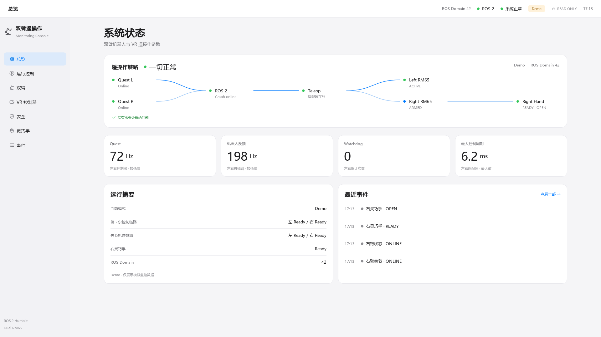
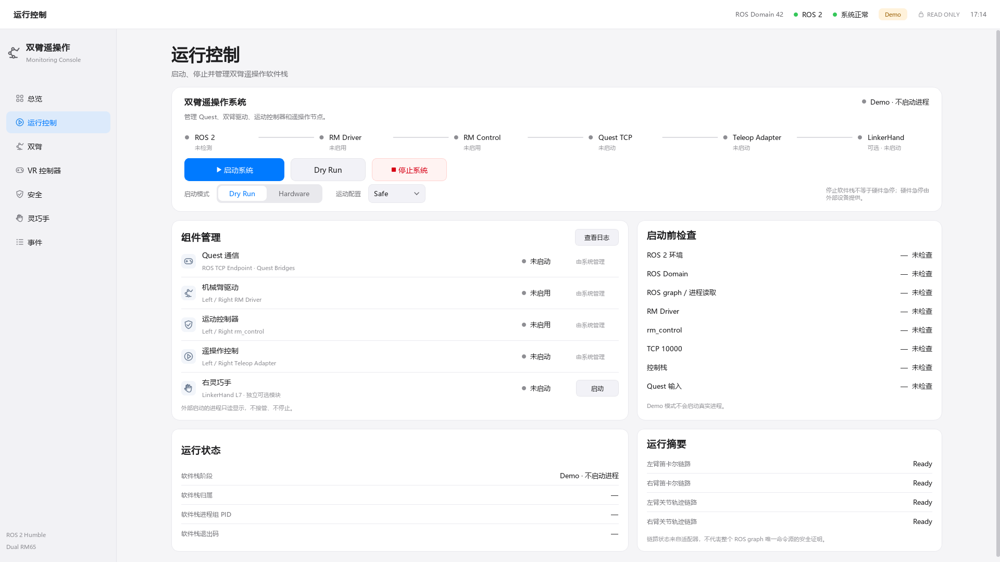

# Dashboard V5 — Real-time teleoperation flow

基线：`a27eb4d1f7c23a073a0a6f1e667db15af220638c`。分支 `feat/teleop-dashboard`，PR #10 保持 OPEN、不合并。
本轮仅改变总览与运行控制的展示，没有启动真实硬件。

## 视觉身份与边界

- 总览主面板用双 Quest 汇合、双 RM65 分支、仅右侧灵巧手支线呈现遥操作链路。
  节点仅由 8 px 状态点、名称和小号状态文字构成；1.5 px 曲线没有箭头、动画或发光。
  保持一张主面板、四项原有指标、两张底部卡片，指标计算不变。
- 运行控制主面板独立展示 ROS 环境 → Driver → Control → Quest TCP → Adapter → 可选 Hand。
  这是组件状态顺序展示，不是新增依赖图或启动算法。按钮、模式和配置保留原有行为。
- 原底部启动时间线改为安静的“运行状态”列表，显示已有软件栈阶段、归属、PID 与退出码；
  不编造启动时间或耗时。独立 Hand 的进程状态仍由原组件行和灵巧手页面显示。
- 不修改其他五页、共享样式、侧栏、窗口框架或图标。没有新增图片、主题、控制、页面或设置。
- `flow_widget.py` 中的 `TeleopFlowWidget`、`FlowNode` 和映射函数仅依赖 Qt 与现有快照。
  数据只流向绘制；不会回写模型、影响预检或触发进程。

## 映射依据

| 节点 | 原有数据 | 展示语义 |
|---|---|---|
| Quest L / R | controller pose/input StreamHealth | 两者在线才 Online；缺一路显示 STALE |
| ROS 2 | node_count / monitor_error | Graph online 或离线/错误，不声称整个控制栈就绪 |
| Teleop | 两臂 status health、parse_error、adapter state | 新鲜适配器状态的汇总；正常时写“适配器在线”，不替代 command path |
| Left / Right RM65 | status、robot、joint health + adapter state | 保留 ACTIVE / ARMED；新鲜 FAULT 明确红色；旧状态不能冒充新鲜反馈 |
| Right Hand | 原 LinkerHand health / state / toggle | 可选未连接为灰；区分从未收到与曾在线后 LOST；故障仍明确显示 |
| Runtime ROS 2 | RuntimeSnapshot.facts.environment_ok | “环境已加载”仅指环境，不代表 graph 或 robot ready |
| Runtime 五组件 | RuntimeSnapshot.components | 直接呈现现有 readiness/ownership；不根据 PID 推断 READY |

在线链路使用浅蓝灰；强蓝仅用于现有 ACTIVE、command path ready、Quest pose/input 与 target
均新鲜的分支。Fault 红、Warning 橙、停止/未知灰；未知枚举不会被渲染为虚构故障或可用链路。
External 是归属标签，不能盖过组件失败。可选手离线不改变既有系统汇总结果。
连线只表达数据与软件状态，绝不是安全认证或唯一命令源证明。

Demo 继续使用原数据：左 ACTIVE、右 ARMED、Quest 72 Hz、反馈 198 Hz。
Runtime Demo 则如实显示未启动/未启用，未伪造真实进程已就绪。V4 的按钮视觉预览与 disabled
交互、槽函数、service guard 完全保留；原 Demo 鼠标点击测试继续验证零进程调用。

## 两轮视觉 QA

第一轮：

- 发现运行控制在 1920 下底部卡片贴近窗口边缘，收紧主面板内部间距并保留 44 px 按钮，恢复底部留白。
- 发现过期 Quest/target 仍可能让旧 ACTIVE 状态对应的连线强蓝高亮；先补失败测试，再收紧纯展示映射。
- 未知状态原本会落入故障/在线颜色，改为中性灰；External 标签不覆盖异常或未知状态。
- 正常 Teleop 文案改为“适配器在线”，避免裸 READY 被误读为控制链路证明。

第二轮：

- 逐张复核四张 V5 截图，并对照 V4 两张 1920 图；双输入汇合与双臂分支已有清晰识别度，未增加装饰。
- 1920 运行页底部两卡完整；1366 总览完整可见，运行页保留预期纵向滚动。节点、中文、按钮无重叠。
- 将进程字段标题明确为“软件栈”，避免把独立手的进程归属误读为主软件栈归属。
- 独立只读审查确认主 CTA、连线颜色、卡片数量和布局边界通过；无需增加阴影或改其他页面。

## 测试与行为审计

新增 25 项 Flow / 页面用例；先记录构造、故障、过期、未知状态及页面集成 RED，再实现 GREEN。
覆盖左右状态、可选手、外部进程、停止/启动/就绪、Demo、1280/1366/1920 的节点不重叠与截图。
原 141 项 Ubuntu 用例全部保留；原 V4 六步结构断言改为六个 Flow 节点，未减少测试或放宽小屏断言。

下列十个文件相对 V4 没有 diff：`models.py`、`ros_monitor.py`、`demo_data.py`、
`process_manager.py`、`preflight.py`、`runtime_service.py`、`runtime_observer.py`、
`process_environment.py`、`runtime_dialogs.py`、`app.py`。
原冻结测试、ROS 输出端点静态审查、Demo no-op、POSIX 生命周期用例全部保留。
ROS 层仍为 13 subscriptions、0 publishers、0 services、0 service/action clients。
启动参数、SIGINT→SIGTERM→SIGKILL、外部进程保护、LinkerHand 默认关闭均未变。

Windows 完整 Dashboard：**162 passed、4 个预期 ROS/POSIX skip、4 subtests passed**。
Ubuntu CI 结果将在本轮最终验证后记录于此。
CI 保留五包构建、Dashboard 单包构建、完整回归、真实 ROS 接收探针、隔离软件 Dry Run 和未 source 入口。
既有未版本化现场 LinkerHand SDK transport CTest 排除项不变；不安装或连接该 SDK。

## V4 → V5

| 页面 | V4 | V5 |
|---|---|---|
| 总览 |  |  |
| 运行控制 |  |  |

小屏：[总览 1366](../screenshots/v5/overview-1366x768.png) · [运行控制 1366](../screenshots/v5/runtime-control-1366x768.png)。
全部是程序原生 Qt offscreen 输出；未使用生成图或图片背景，未覆盖 V4 截图。
